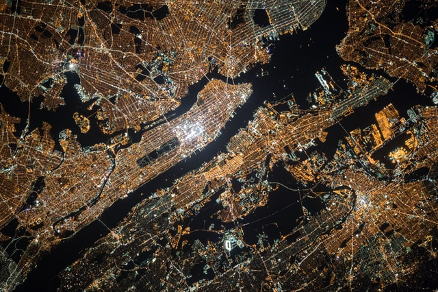

# GDAL benchmarks

This repository contains a series of benchmark to compare GDAL performance between various raster formats.

<p align="center">
  
</p>
Photo by <a href="https://unsplash.com/es/@nasa?utm_source=unsplash&utm_medium=referral&utm_content=creditCopyText">NASA</a> on <a href="https://unsplash.com/?utm_source=unsplash&utm_medium=referral&utm_content=creditCopyText">Unsplash</a>.

## Getting started

:warning: The benchmarks generate a lot of big files. Be sure to have at least 10 GB of disk space.

### Prerequisites

You need the following tools:

- `make` to execute the Makefile
- [Python 3](https://wiki.python.org/moin/BeginnersGuide/Download) and the packages `numpy`, `matplotlib` and `scipy` (see the [hyperfine documentation](https://github.com/sharkdp/hyperfine/tree/master/scripts)) to generate the plots
- [GDAL](https://gdal.org/) to execute the commands

### Steps

Clone this repository (including the submodule [hyperfine](https://github.com/sharkdp/hyperfine))

```shell
git clone https://github.com/sguimmara/gdal-benchmarks.git --recursive
```

Start the benchmarks with the default values

```shell
make
```

Alternatively, if you wish to use a different JPEG2000 driver, you can provide its name. For example, if you have the [ECW JP2 driver](https://gdal.org/drivers/raster/jp2ecw.html):

```shell
make clean
make JP2DRIVER=JP2ECW
```

_Be sure to clean before generating files with a different driver otherwise `make` will not detect the change._

This will generate all the test files from the `source.jpg` image, then execute all benchmarks. The results are in the `out` directory.
